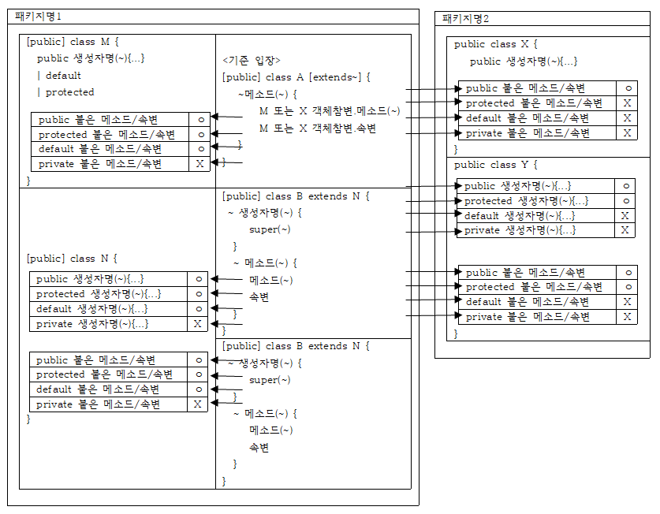

## 목차
{: .no_toc .text-delta }

1. TOC
{:toc}
---

# **클래스**
> 1. Java에서 클래스란 속성변수, 메소드, 생성자를 정의해놓은 일종의 틀(=템플릿)이다.<br>
> 2. 하나의 클래스 내부에 개발자가 코딩하는 속성변수, 메소드, 생성자의 개수는 각각 0개 이상이다.<br>
>
|---|-------|
|메소드|변수/연산자/조건문/반복문 사용, 객체 생성, 객체의 메소드 호출 등의 실행 구문을 정의한다.<br>실행구문을 대표하는 이름으로 메소드명을 지정하고 메소드명을 호출하면 내부의 실행구문이 실행된다. |
|속성변수|기본형 데이터 또는 참조형 데이터(=객체의 메모리 위치 정보 데이터)를 저장한다.<br>메소드 내부의 실행구문 실행 과정 중에 필요한 데이터가 저장되는 곳이다.|
|생성자|클래스가 객체화되면 자동으로 단 1회 실행할 실행 구문을 정의한다.<br>주로 객체 생성 후 사용할 속성변수에 데이터를 입력하는 코딩이 삽입된다.<br>생성자 이름은 클래스명과 동일하다.|

---

## **클래스 특징**
> 1. 클래스 파일(*.class)로 저장되어 있다.<br>
> + 클래스 파일을 만들려면 자바 파일(~.java)을 만든 후 컴파일하면 클래스 파일이 생성된다.<br>
> 2. 클래스에 정의된 속성변수와 메소드를 호출하여 사용하려면 Heap이란 메모리 공간에 올려놓고 호출한다.
     >   + 이 때 Heap이란 메모리 공간에 올라간 클래스를 객체(Object) 또는 인스턴스(instance)라고 부른다.<br>
> 3. 하나의 클래스는 여러 번 객체화하여 사용할 수 있다.<br>
> 4. 자주 사용되는 기능을 가진 클래스들은 미리 만들어져 JDK 안에 내장되어 있다.<br>
> 5. 클래스를 객체화하는 이유는 객체가 소유한 메소드 또는 속성변수를 호출하기 위함이다.<br>

|---|-------|
|절차식 프로그래밍|변수/연산자/조건문/반복문 등을 사용하여 절차대로 프로그래밍 하는 것을 말한다.<br>단점 : 코드의 재사용이 어렵다. / 유지보수가 어렵다.|
|객체지향 프로그래밍|객체 중심으로 프로그래밍 하는 것을 말한다.<br>(즉, 클래스를 객체화 한 후 메소드를 호출하면서 프로그래밍 하는 것을 말한다.)<br>메소드에 정의된 실행구문을 몰라도 메소드 호출만으로도 쉽게 전체 프로그램을 만들 수 있다.<br>클래스로 정의되어 있으므로 코드의 재사용이 가능하여 유지 보수가 쉽다.|

---

## **클래스 구조**
### **클래스 정의 형식**

> 1. package ~; 구문 다음에 import ~; 구문이 나와야 한다. 순서가 다르면 컴파일이 불가능하다.
> 2. 속성변수, 생성자, 메소드는 클래스를 구성하는 멤버이며 각각 0개 이상 나올 수 있다.
> 3. 생성자명은 클래스명과 동일하다.
> 4. 참조 자료형에는 클래스명, 인터페이스명도 올 수 있다.
> 5. 하나의 java 파일 안에 여러 클래스를 선언하여 관리할 수 있다.


```java
클래스명.java

package 패키지명;

import 수입클래스패키지명.수입클래스명

[public] [abstract|final] class 클래스명 {
    public|protected|default|private [static] [final] 기본자료형|참조자료형 속성변수명=데이터];
    
    public|protected|default|private 생성자명 ([자료형 매개변수, ~]) {
        실행구문;
    }
    
    public|protected|default|private [static] [synchronized] [final|abstract] 기본형자료형|참조자료형|void 메소드명 ([자료형 매개변수, ~]) {
        실행구문;
    }
}

```

---

### **package 패키지명**
> 1. 클래스의 소속 묶음명을 지정한다.
> 2. 패키지란 서로 기능이 비슷하거나 관련이 있는 클래스 또는 인터페이스 등을 묶어놓은 묶음이다.
> 3. 관용적으로 패키지는 3단계 이상이다.

---

### **import 패키지명.수입클래스명**
> 1. 타 패키지 소속 클래스를 객체화해서 사용할 경우 수입할 패키지명과 클래스명을 지정한다.
> 2. 0개 이상 선언할 수 있다.

---

### **속성변수**
> 1. 객체가 살아있는 동안 동작한다.
> 2. 자동, 수동 초기화가 가능하다.

---

### **지역변수**
> 1. 메소드가 사라지면 사라진다.
> 2. 수동 초기화만 가능하다.

---

## **클래스 접근지정자**
> 클래스의 수입 목적은 객체화 한 후에 메소드를 호출하기 위함이다.

|---|-------|
|public|같거나 다른 패키지의 타 클래스에서 수입이 가능하다.|
|default|같은 패키지의 타 클래스에서만 수입이 가능하다.|


---

## **클래스 성격지정자**

> 1. abstract와 final이 동시에 클래스명 앞에 올 수 없다.
> 2. abstract는 상속이 목적이고 final은 상속 불가가 목적이다.
> 3. 상속(inheritance)
> + 어떤 클래스가 소유한 멤버(속성변수, 메소드 등)를 다른 클래스에게 그대로 물려주는 것을 말한다.

|---|-------|
|abstract|블록이 없는 메소드를 하나 이상 소유한 클래스이다.<br>추상 클래스라고 한다.|
|final|자식 클래스를 가질 수 없는 클래스이다.<br>상속이 불가능한 클래스이다.|

---

# **속성변수**
> 1. 기본형 데이터 또는 참조형 데이터(= 객체의 메모리 위치 주소값)을 저장하는 변수이다.
> 2. 메소드 안에 선언된 변수는 속성변수가 아니라 지역변수로 메소드 안에서 선언되어 호출되고 메소드 종료 시 메모리 상에서 삭제된다.

---

## **속성변수 특징**
> 1. 속성변수 선언 후 수동 초기화 하지 않으면 디폴트 값으로 자동 초기화된다.
> 2. 지역변수는 수동 초기화하지 않으면 자동 초기화되지 않는다.

|---|-------|
|할당(assignment)|변수에 데이터를 저장하는 행위|
|초기화(initialization)|변수 선언 후 처음 데이터를 저장하는 행위|

---

## **속성변수 선언 형식**
> 1. `default`란 아무 접근지정자도 붙지 않음을 의미한다.
> 2. 메소드 안에서 선언된 변수는 지역변수로 메소드 안에서 선언되어 호출되고 메소드 종료 시 삭제된다.
> 3. 메소드 안에 선언된 지역변수의 자료형 앞에 `final`이 붙으면 갱신이 불가능하다.

|-------|
|public \| protected \| default \| private \[static\] \[final] 기본자료형 \| 참조자료형 속성변수명 \[=데이터\];| |

---

## **속성변수의 접근지정자**
> 1. 타 클래스 메소드에서 속성변수의 호출 가능 여부를 지정한다.
> 2. 관용적으로 대부분 속성변수는 `private`를 붙여 타 클래스에서 직접 호출을 막는다.
     >    + 타 클래스란 부모 자식 관계가 없는 클래스라는 의미이다.
>    + 자식 클래스는 정해진 규칙 아래에서 객체 생성 코드 없이 부모 클래스의 속성변수 혹은 메소드를 호출할 수 있다.
>    + 동료 메소드 또는 속성변수란 같은 소속 클래스의 메소드 혹은 속성변수를 말한다.
>    + `static`이 붙은 속성변수는 `객체참조변수.속성변수명` 대신 `클래스명.속성변수명`으로 호출할 수도 있다.

---

## **속성변수의 성격 지정자**

|종류|의미|
|--|-------|
|final|처음에 저장된 데이터는 추후 동료 메소드 안에서의 갱신을 금지한다.<br>`final`이 붙은 속성변수는 자동 초기화되지 않으므로 변수 선언과 동시에 수동 초기화 또는 생성자 안에서 수동 초기화해야한다.<br>`final`이 붙은 변수는 종단변수라고 한다.|
|static|`static`이 붙은 속성변수는 객체참조변수.속성변수명 또는 `클래스명.속성변수명` 형식으로 호출이 가능하고 `호출한 모든 곳에서 공유`하게 된다.<br>- `객체 생성 후 객체참조변수명.속성변수명 = 데이터1;`가 실행되면 클래스명.속성변수명으로 호출해도 데이터1이 저장되어있다.<br>static이 없는 속성변수는 객체참조변수명.속성변수명 형식으로만 호출이 가능하다.<br>static이 붙은 변수를 클래스 변수 혹은 공유 변수라고도 한다.|

---

## **속성변수 자료 유형**
> 1. 속성변수 안에 저장될 데이터의 유형을 설정한다.
> 2. 속성변수는 선언 후 수동 초기화하지 않으면 초기화된다.
>    + 예외적으로 `final`이 붙은 속성변수는 자동초기화되지 않으므로 수동초기화해야한다.
> 4. 지역변수는 선언하자마자 자동초기화되지 않으므로 선언 후에 꼭 수동초기화해야한다.

|종류|의미|
|--|-------|
|기본 자료형|기본형 데이터를 저장할 변수를 선언할 때 붙인다.<br>기본적으로 속성변수를 선언하고 수동초기화하지 않으면 디폴트 값으로 자동초기화된다.|
|참조 자료형|객체의 메모리 위치 주소값을 저장할 변수를 선언할 때 붙인다.<br>참조 자료형 자리에는 저장되는 객체의 메모리 위치 주소값에서 객체의 전신인 클래스명이 온다.(인터페이스도 올 수 있다.)<br>객체의 메모리 위치 주소값을 저장할 변수를 객체 참조 변수(reference type)라고 한다.<br>참조형으로 속성변수를 선언하고 수동초기화하지 않으면 `null`값으로 자동초기화된다.|

---

# **메소드**
> 1. 실행 구문을 서술한 영역을 말한다.
> 2. 이름을 붙여 선언하며 이름을 호출하면 실행 구문이 실행된다.

## **메소드 선언 형식**

```java
public | protected | default | private [static] [synchronized] [final | abstract] 기본자료형 | 참조자료형 | void
    메소드명 ([자료형 매개변수, ~]) {
        실행구문;
    }
```

## **메소드의 접근지정자**
> 타 클래스에서 메소드에서 메소드의 호출 가능 여부를 지정한다.


## **메소드의 성격지정자**

|종류|의미|
|--|-------|
|static|static 이 붙는 메소드는 `객체참조변수명.메소드명` 또는 `클래스명.메소드명` 형식으로 호출이 가능하고 객체를 생성하지 않아도 호출이 가능하다.<br>static이 없는 메소드는 `객체참조변수명.메소드명` 형식으로만 호출이 가능하다.<br>static이 붙은 메소드 안에서 나오는 동료 속성변수에는 static이 붙어야한다.|
|final|소속 클래스를 타 클래스에 상속해줄 경우 타 클래스에서 메소드의 재정의를 불가능하게 한다.|
|abstract|바디가 없는 메소드에 붙인다.<br>바디가 없는 메소드가 존재하면 클래스 앞에서 abstract 가 붙어야한다.|
|synchronized|메소드 실행 중일 때 다른 스레드에서 호출 불가능하게 한다.|


## **메소드의 리턴형**
> 메소드가 실행된 후에 내놓는 반환 데이터의 자료 유형을 설정한다.

|종류|의미|
|--|-------|
|기본 자료형|메소드 실행 후 기본 자료형의 데이터를 반환한다.<br>메소드 내부에 반드시 `return 기본자료형데이터;` 가 있어야 한다.<br>return의 의미는 메소드 실행을 중지하고 오른쪽 데이터를 호출한 곳으로 반환하라는 의미이다.|
|참조 자료형|메소드 실행 후 객체의 메모리위치주소값을 반환한다.<br>메소드 내부에 return 객체의 메모리위치주소값이 있어야한다.|
|void|메소드가 실행 후에 아무런 값도 반환하지 않는다.<br>메소드 내부에 `return 데이터;`가 있으면 안된다. 단, `return;`은 있어도 된다.<br>return; 은 메소드 종료의 의미만 있다.|


## **메소드 오버로딩**
> 같은 이름의 메소드를 2개 이상 정의하는 것을 말한다.


### **메소드 오버로딩 규칙**
> 1. 메소드의 이름은 같고 매개변수의 개수나 매개변수의 자료형은 달라야한다.
> 2. 메소드의 리턴형은 오버로딩 규칙과 관련이 없다.


### **메소드 안에 선언된 지역변수**
> 1. 지역변수는 메소드 호출 시 생성되고 메소드 종료 시 사라진다.
> 2. 지역변수는 수동초기화 않는다고 속성변수처럼 자동초기화한다.
> 3. 지역변수는 수동초기화하지 않으면 선언시에는 에러가 발생하지 않고 사용 시 에러가 발생한다.

---

## **매개변수**
> 1. 데이터를 전달하면서 메소드를 호출할 때 전달 데이터를 저장할 변수이다.
> 2. 매개변수는 0개 이상 나올 수 있다. 2개 이상 나올 경우 중간에 `,`를 삽입한다.
> 3. 매개변수는 메소드 안에서만 사용되는 일종의 지역변수이다.

---

# **생성자**
> 1. 클래스를 객체화한 후 자동으로 한번만 호출되는 실행구문 영역을 말한다.
> 2. 리턴형을 표시하지 않으므로 `return 데이터;` 가 있을 수 없다.
> 3. 생성자 호출 시 데이터를 전달해서 호출할 경우에는 매개변수를 설정한다.
> 4. 생성자가 0개면 컴파일 시 기본 생성자인 `public 생성자명(){}`이 자동 삽입된다.(1개 이상은 자동으로 안된다.)

---

## **생성자 선언형식**
> 생성자의 호출 가능여부를 지정한다.

```java
public | protected | default | private 생성자 ([자료형 매개변수, ~]) {
        실행구문;
    }
```

---

## **new 생성자명(~)**
> 1. 호출 가능한 생성자명(~)을 소유한 클래스를 객체화하고 생성자명을 호출한다. 그 후에 객체의 메모리위치주소값을 리턴한다.
> 2. 생성자 호출이 불가능하다는 말은 호출할 생성자가 존재하지 않거나 접근지정자에 의해 숨겨져 찾을 수 없음을 의미한다.

---

## **생성자 오버로딩**
> 1. 같은 이름의 생성자를 2개 이상 정의하는 것을 말한다.
> 2. 생성자명은 같더라도 매개변수의 개수와 자료형은 달라야한다.

---

## **생성자 호출 방법**
> 1. `new`에 의한 객체 생성 과정에서 `new 생성자명(~)` 형식으로 호출한다.
> 2. 동료 생성자 안에서 `this(~)` 를 사용하여 호출한다.
> 3. 자식 생정자 안에서 `super(~)` 를 사용하여 호출한다.
> 4. 동료 메소드 안에서 동료 생성자를 호출할 수 없다.

---

# **클래스로부터 객체 생성, 속성변수 혹은 메소드 호출 방법**

|절차|코딩 형식|
|--|-------|
|1단계 : 클래스 수입|import 수입클래스패키지명.수입클래스명;|
|2단계 : 클래스 객체화|클래스 객체참조변수 = new 생성자명([데이터1, ~])|
|3단계 : 속성변수 / 메소드 호출|객체참조변수.속성변수명|
||객참변수.메소드명([데이터1, ~])|

## **클래스명 객체참조변수 = new 생성자명([데이터1, ~])**
### **작동 순서**
> 1. 객참변수 선언
> 2. 메소드 영역에 존재하는 클래스 중 호출 가능한 생성자명([데이터1, ~])을 가진 클래스를 Heap 영역으로 올린다.
>    + Heap 영역에 올라간 클래스는 객체라고 부른다.
>    + 생성자명은 클래스명과 동일하다.
>    + 생성자의 접근지정자에 따라 호출 불가능 생성자면 에러가 발생한다.
> 3. 객체의 생성자명([데이터1, ~])을 호출한다.
> 4. 객체의 메모리위치주소값을 리턴해서 객체참조변수에 저장한다.

### **특징**
> 1. 객체참조변수 없이 객체 생성과 동시에 속성변수나 메소드를 호출할 수도 있다. 이 경우 객체참조변수가 없으므로 객체의 속성변수나 메소드의 재호출이 불가능하다.
> 2. 클래스의 수입이 없으면 `new` 에 의한 클래스의 객체화가 불가능하므로 결국 속성변수, 메소드 호출도 불가능하다.
> 3. 클래스 수입을 하더라도 클래스의 객체화가 불가능하면 속성변수, 메소드 호출도 불가능하다. 단, `static` 이 붙으면 가능하다.
> 4. 클래스 수입을 하고 클래스 객체화가 가능하더라도 접근지정자에 따라 속성변수, 메소드 호출이 불가능할 수도 있다.
> 5. `static` 이 붙은 속성변수나 메소드는 `new` 에 의한 객체 생성 코딩 없이 `클래스명.속성변수명` 혹은 `클래스명.메소드명(~)` 으로 호출이 가능하며 객체 유무에 관계없이 호출한 모두가 공유한다.
> 6. 아래 형식들로 사용 가능하다.
>    + 부모클래스명 객체참조변수 = new 생성자명([데이터1, ~]);
>    + 인터페이스명 객체참조변수 = new 생성자명([데이터1, ~]);

---

# **this.예약어**
> 클래스가 소유한 고유 멤버인 속성변수, 메소드, 생성자를 지칭하거나 클래스가 객체화될 때 객체의 메모리위치주소값을 말한다.

## **사용 형식**

|형식|의미|
|--|-------|
|this.속성변수명|클래스의 고유멤버인 속성변수를 호출한다.|
|this.메소드명(~)|클래스의 고유멤버인 메소드를 호출한다.|
|this(~)|클래스의 고유멤버인 다른 동료 생성자를 호출한다.|
|this|this를 가진 클래스가 객체화될 경우 객체의 메모리위치 주소값을 의미한다.|

## **사용 목적**
> 1. 메소드의 매개변수명과 속성변수명이 같을 경우 구별하기 위해 `this.속성변수명` 형식으로 사용한다.
> 2. 부모 클래스와 자식 클래스의 속성변수 / 메소드 / 생성자의 이름이 같을 경우 구별하기 위해 사용한다.

---

# **접근지정자 총 정리**


## **메소드나 속성변수의 호출 가능 여부**
> 1. A 클래스 앞에 붙을 경우
>    + public : 어디서나 가능하다.
>    + protected : 같은 패키지 내에서만 가능하다.(부모 자식 관계도 가능하다.)
>    + default : 같은 패키지 내에서만 가능하다.
>    + private : 같은 패키지, 같은 클래스 내에서만 가능하다.
> 2. M 클래스 앞에 붙을 경우
>    + 같은 패키지 내에서 public, protected, default 는 가능하다.
>    + private 는 불가능하다.
> 3. X 클래스 앞에 붙을 경우
>    + public 만 가능하다.


