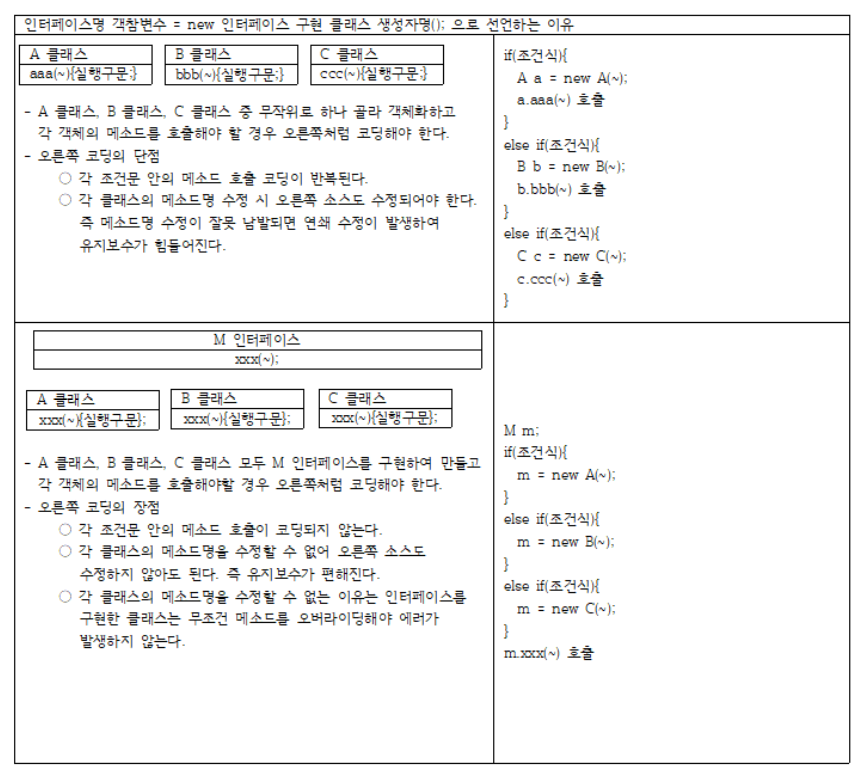

## 목차
{: .no_toc .text-delta }

1. TOC
{:toc}
---

# **인터페이스**
> 1. public, final, static 의 성격을 가진 속성변수와 public, abstract 의 성격을 가진 메소드로만 구성된 단위 프로그램이다.
> 2. 추상메소드와 일반메소드가 섞여 있으면 추상클래스라고 한다.

---

## **사용 목적**
> 1. 인터페이스에 정의한 추상메소드를 다른 클래스에서 재정의하여 사용하므로 클래스의 메소드 제작 명세표 역할을 한다.
> 2. 인터페이스에 계획된 메소드명을 만들고 클래스가 이 메소드 이름만 그대로 가져다가 실해 구문을 만듦으로써 계획된 메솓로 구성된 클래스를 만들 수 있다.
> 3. 다중 구현이 가능하므로 클래스의 단일 상속이 가지는 문제점인 확장성, 재사용성의 한계를 보완한다.

---

## **사용 형식**
> 1. 속성변수, 메소드는 각 0개 이상 나올 수 있다.
> 2. <font color='#ff0000'>※ 인터페이스가 소유한 속성변수 앞에 public, final, static 이 생략되어도 public, final, static 의 성질을 가진다.</font>
> 3. <font color='#ff0000'>※ 인터페이스가 소유한 추상메소드 앞에 public, final, abstract 가 생략되어도 public, final, abstract 의 성질을 가진다.</font>

```java
[public] interface 인터페이스명 {
    public static final 자료형 속성변수 = 데이터;
    
    public abstract 리턴형 메소드명([자료형 매개변수]);
}
```

---

## **인터페이스의 상속**
> 1. 인터페이스가 다른 인터페이스에게 멤버를 물려주는 것을 `상속(ingeritance)` 라고 한다.
> 2. 다른 인터페이스에서 물려받은 추상메소드를 재정의하면 안된다.
> 3. 다른 인터페이스에서 물려받은 속성변수를 갱신할 수 없다.(final 속성으로 인해)
> 4. 클래스가 다른 클래스에게 멤버를 물려주는 것도 `상속`이다.

---

### **인터페이스 상속의 형식**

```java

[public] interface 인터페이스명1 {
    
}

[public] interface 인터페이스명2 extends 인터페이스명1 {

}

```

---

## **인터페이스의 구현**
> 1. 인터페이스가 다른 클래스에게 멤버를 물려주는 것을 `구현(implements)` 이라고 한다.
> 2. 인터페이스에서 물려받은 추상메소드를 모두 재정의해야만 객체화가 가능한 일반클래스가 된다.
> 3. 인터페이스에서 물려받은 속성변수를 갱신할 수 없다.
> 4. 인터페이스와 클래스를 부모자식관계 라고 표현하지 않는다.(부모자식관계는 클래스 사이에서 상속으로만 가능하다.)
> 5. 인터페이스가 다른 클래스에게 멤버를 물려주어 구현할 때 물려받은 추상메소드를 모두 재정의하지 않으면 추상클래스가 된다.

---

### **인터페이스 구현의 형식**

```java

[public] interface 인터페이스명1 {
    
}

~ class 클래스명 implements 인터페이스명1 {

}

```

---

## **인터페이스의 특징**
> 1. 인터페이스가 소유한 속성변수 앞에 **<font color='#0101DF'>public, final, static</font> 성격이 붙지 않아도 해당 성질을 가진다.
>    + 인터페이스의 속성변수는 static 성격이므로 new 에 의한 객체 생성 없이 `인터페이스명.속성변수`로 호출이 가능하다.
> 2. 인터페이스가 소유한 추상메소드 앞에 **<font color='#0101DF'>public, abstract</font>가 붙지 않아도 해당 성질을 가진다.
>    + public, abstract 가 없으면 컴파일 시 컴파일러가 자동으로 삽입한다.
> 3. 인터페이스를 구현한 클래스는 메소드를 재정의할 때 반드시 public 접근지정자를 붙여야 한다.
> 4. 인터페이스의 속성변수는 반드시 선언과 동시에 초기화해야한다.
> 5. 여러 개의 인터페이스가 하나의 `인터페이스`에게 `상속`해줄 수 있다.
> 6. 여러 개의 인터페이스가 하나의 `클래스`에게 `구현`해줄 수 있다.
>    + 클래스끼리는 단일 상속만 가능하다. 즉 클래스끼리는 다중 상속이 불가능하다.
>    + 다중 구현이 가능하므로 클래스의 단일 상속이 가진 문제점인 `확장성, 재사용성`의 한계를 보완한다.
> 7. 1개 이상의 인터페이스와 1개의 클래스가 동시에 하나의 클래스에게 구현하고 속해줄 수 있다.
> 8. 인터페이스는 `new`에 의해 객체화 될 수 없다. 단, 익명 클래스처럼 객체화하면서 메소드를 재정의하면 가능하다.
> 9. 인터페이스를 컴파일하면 클래스처럼 클래스파일이 생성된다.

---

### **클래스가 객체화되기 위한 조건**
> 1. body 가 없는 메소드가 없어야 한다.
> 2. 조상 클래스 중에 추상메소드를 재정의한 클래스가 있어야 한다.
> 3. 생성자 앞에 `private`가 없어야 한다.
> 4. 클래스 앞에 `abstract`가 붙어있어도 에러가 나지 않아야 한다.

---

## **인터페이스를 구현한 클래스의 객체화 형식과 메소드/속성변수 호출**

```java

인터페이스 구현 클래스명 객참변수 = new 인터페이스 구현 클래스 생성자명(~);

```

|메소드/속성변수 호출 형태|호출가능 여부|
|객참변수.인터페이스 구현 클래스의 고유메소드(~)|O|
|객참변수.인터페이스 구현 클래스의 고유 속성변수|O|
|객참변수.인터페이스 구현 클래스의 재정의 메소드(~)|O|
|객참변수.인터페이스의 속성변수|O|

---

```java

인터페이스명 객참변수 = new 인터페이스 구현 클래스 생성자명(~);

```

## **인터페이스를 구현한 클래스의 메소드/속성변수 호출**

|메소드/속성변수 호출 형태|호출가능 여부|
|객참변수.인터페이스 구현 클래스의 고유메소드(~)|X|
|객참변수.인터페이스 구현 클래스의 고유 속성변수|X|
|객참변수.인터페이스 구현 클래스의 재정의 메소드(~)|O|
|객참변수.인터페이스의 속성변수|O|
|((인터페이스 구현 클래스명)객참변수).인터페이스 구현 클래스의 고유 메소드(~)|O|
|((인터페이스 구현 클래스명)객참변수).인터페이스 구현 클래스의 고유 속성변수|O|




 
---