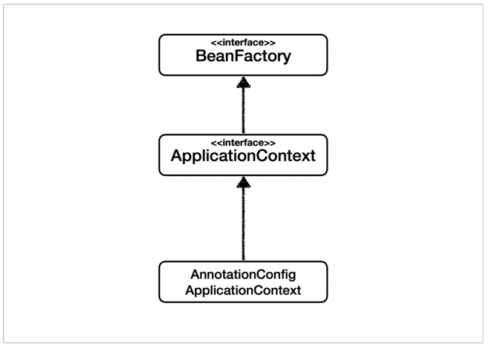
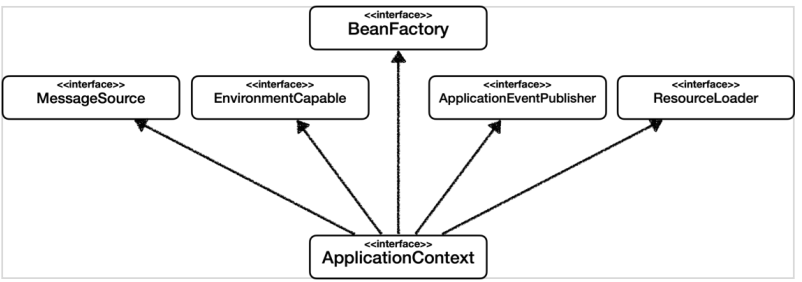

## 목차
{: .no_toc .text-beta }

1. TOC
{:toc .text-gamma}
---

# **BeanFactory 와 ApplicationContext**
## **BeanFactory**
> 
> + 스프링 컨테이너의 최상위 인터페이스다. 
> + 스프링 빈을 관리하고 조회하는 역할을 한다. 
> + getBean() 을 제공한다. 
> + BeanFactory 를 직접 사용할 일은 거의 없다.

---

## **ApplicationContext**
> + BeanFactory에 부가 기능을 더한 것이다. 
> + BeanFactory 기능을 모두 상속받아서 제공한다. 
> + 주로 부가 기능이 포함된 ApplicationContext를 사용한다.

---

## **ApplicationContext 부가기능**
> 
> 1. `MessageSource`
> + 메시지 소스를 활용한 국제화 기능이다.
> + 한국에서 들어오면 한국어로, 영어권에서 들어오면 영어로 출력하는 기능이다.
> 2. `EnvironmentCapable`
> + 환경변수에 대한 기능이다.
> + 로컬, 개발, 운영 등을 분리해서 처리하는 기능이다.
> 3. `ApplicationEventPublisher`
> + 애플리케이션 이벤트에 대한 기능이다.
> + 이벤트를 발행하고 구독하는 모델을 편리하게 지원한다.
> 4. `ResourceLoader`
> + 편리하게 리소스를 조회할 수 있게 해주는 기능이다.
> + 파일, 클래스패스, 외부 등에서 리소스를 편리하게  조회하는 기능이다.

---

## **📌 핵심**
> + ApplicationContext는 BeanFactory의 기능을 상속받는다.
> + ApplicationContext는 빈 관리기능 + 편리한 부가 기능을 제공한다.
> + BeanFactory를 직접 사용할 일은 거의 없다. 부가기능이 포함된 ApplicationContext를 사용한다.
> + BeanFactory나 ApplicationContext를 스프링 컨테이너라 한다.