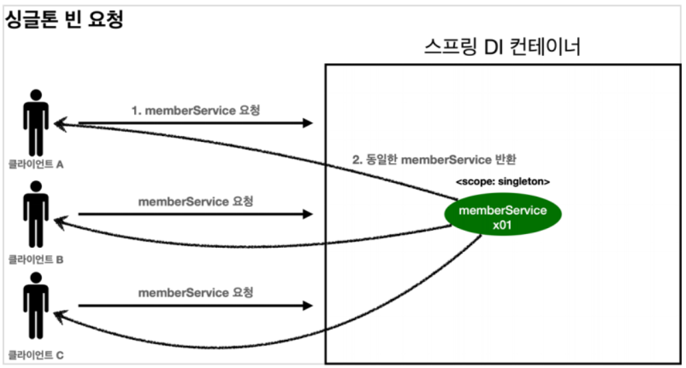
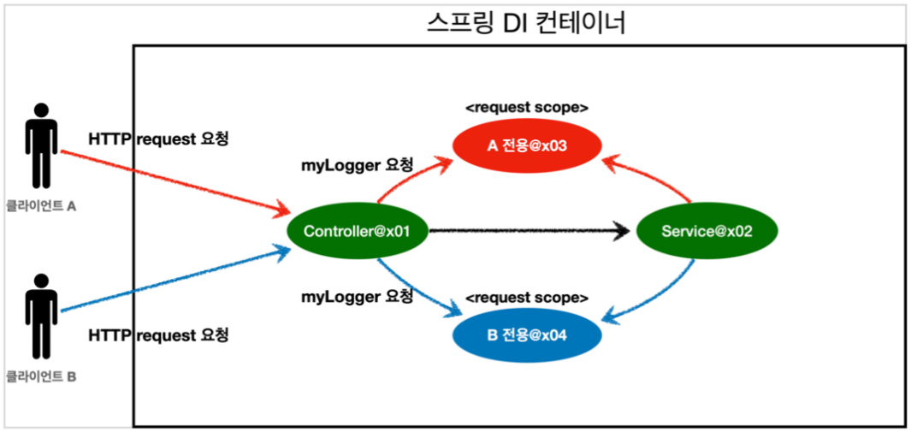

## 목차
{: .no_toc .text-beta }

1. TOC
{:toc .text-gamma}
---

# **빈 스코프**
> + 스프링 빈은 기본적으로 싱글톤 스코프로 생성된다. 이 덕분에 스프링 빈이 스프링 컨테이너의 시작과 함께 생성되어서 컨테이너가 종료될 때 까지 유지된다.
> + 스코프는 빈이 존재할 수 있는 범위를 의미한다.
> + 스프링은 다음과 같은 다양한 스코프를 지원한다.
>
>> ## **1. 싱글톤**
>> + 기본 스코프이며 스프링 컨테이너의 시작과 종료까지 유지되는 가장 넓은 범위의 스코프이다.
>>
>> ## **2. 프로토 타입**
>> + 스프링 컨테이너는 프로토타입 빈의 생성과 의존관계 주입까지만 관여하고 더는 관리하지 않는 매우 짧은 범위의 스코프이다.
>> + 요청이 들어오면 `빈 생성 > 의존관계 주입 > 초기화`를 한 후에 클라이언트에게 반환하고 더 이상 관리하지 않는다.
>>
>> ## **3. 웹 관련 스코프**
>> + **<font color='#0101DF'>request</font>**: 웹 요청이 들어오고 나갈때까지 유지되는 스코프이다.
>> + **<font color='#0101DF'>session</font>**: 웹 세션이 생성되고 종료될때 까지 유지되는 스코프이다.
>> + **<font color='#0101DF'>application</font>** : 웹의 서블릿 컨텍스와 같은 범위로 유지되는 스코프이다.
>> + **<font color='#0101DF'>websocket</font>** : 웹 소켓과 동일한 생명주기를 가지는 스코프이다.

---

# **싱글톤 스코프**
> + **<font color='#F0000'>싱글톤 스코프의 빈을 조회하면 스프링 컨테이너는 항상 같은 인스턴스의 스프링 빈을 반환한다.</font>**
> + 반면에 프로토타입 스코프를 스프링 컨테이너에 조회하면 스프링 컨테이너는 항상 새로운 인스턴스를 반환한다.
> + 스프링 컨테이너에 요청할 때 마다 새로 생성된다.
> + 종료 메서드가 호출되지 않는다.
> + 프로토타입 빈은 프로토타입 빈을 조회한 클라이언트가 관리해야 한다. 종료 메서드 호출도 마찬가지이다.
> + 빈 스코프는 @Scope("name") 를 사용해서 자동과 수동으로 지정할 수 있다.

## **컴포넌트 스캔 자동 등록**

```java
@Scope("prototype")
@Component
public class HelloBean{ }

```

## **컴포넌트 스캔 수동 등록**

```java
@Scope("prototype")
@Bean
PrototypeBean HelloBean() {
	return new HelloBean();
}

```

## **싱글톤 빈 요청**
> 
> 1. 싱글톤 스코프의 빈을 스프링 컨테이너에 요청한다.
> 2. 스프링 컨테이너는 본인이 관리하는 스프링 빈을 반환한다.
> 3. 이후에 스프링 컨테이너에 같은 요청이 와도 같은 객체 인스턴스의 스프링 빈을 반환한다.
>
> 코드를 확인하면 다음과 같다.
> 1. 빈 초기화 메서드를 실행하고,
> 2. 같은 인스턴스의 빈을 조회하고,
> 3. 종료 메서드까지 정상 호출 된 것을 확인할 수 있다.
>
> ```java
> public class SingletonTest {
>
>     @Test
>     public void singletonBeanFind() {
>         AnnotationConfigApplicationContext ac = new AnnotationConfigApplicationContext(SingletonBean.class);
>
>         SingletonBean singletonBean1 = ac.getBean(SingletonBean.class);
>         SingletonBean singletonBean2 = ac.getBean(SingletonBean.class);
>         System.out.println("singletonBean1 = " + singletonBean1);
>         System.out.println("singletonBean2 = " + singletonBean2);
>         assertThat(singletonBean1).isSameAs(singletonBean2);
>
>         ac.close();
>     }
>
>     @Scope("singleton")
>     static class SingletonBean {
>         @PostConstruct
>         public void init() {
>             System.out.println("SingletonBean.init");
>         }
>
>         @PreDestroy
>         public void destroy() {
>             System.out.println("SingletonBean.destroy");
>         }
>     }
> }
> ```

---

# **프로토타입 스코프**

## **프로토타입 빈 요청 1**
> 
> 1. 프로토타입 스코프의 빈을 스프링 컨테이너에 요청한다.
> 2. 스프링 컨테이너는 이 시점에 프로토타입 빈을 생성하고 필요한 의존관계를 주입한다.

## **프로토타입 빈 요청 2**
> 
> 3. 스프링 컨테이너는 생성한 프로토타입 빈을 클라이언트에 반환한다.
> 4. 이후에 스프링 컨테이너에 같은 요청이 오면 항상 새로운 프로토타입 빈을 생성해서 반환한다.
>
> 코드를 확인하면 다음과 같다.
> + 싱글톤 빈은 스프링 컨테이너 생성 시점에 초기화 메서드가 실행 되지만, 프로토타입 스코프의 빈은 스프링 컨테이너에서 빈을 조회할 때 생성되고, 초기화 메서드도 실행된다.
> + 프로토타입 빈을 2번 조회했으므로 완전히 다른 스프링 빈이 생성되고, 초기화도 2번 실행된 것을 확인할 수 있다.
> + 싱글톤 빈은 스프링 컨테이너가 관리하기 때문에 스프링 컨테이너가 종료될 때 빈의 종료 메서드가 실행된다.
> + 하지만 프로토타입 빈은 스프링 컨테이너가 생성과 의존관계 주입 그리고 초기화 까지만 관여하고, 더는 관리하지 않는다.
> + 따라서 프로토타입 빈은 스프링 컨테이너가 종료될 때 @PreDestroy 같은 종료 메서드가 전혀 실행되지 않는다.
>
> ```java
> public class PrototypeTest {
>     @Test
>     void prototypeBeanFind() {
>         // PrototypeBean 를 넣어주면 해당 클래스가 컴포넌트의 대상인것 처럼 동작한다. 따라서 아래에서 @Component 어노테이션이 없어도 된다.
>         AnnotationConfigApplicationContext ac = new AnnotationConfigApplicationContext(PrototypeBean.class);
>
>         System.out.println("find prototypeBean1");
>         PrototypeBean prototypeBean1 = ac.getBean(PrototypeBean.class);
>         System.out.println("find prototypeBean2");
>         PrototypeBean prototypeBean2 = ac.getBean(PrototypeBean.class);
>         System.out.println("prototypeBean1 = " + prototypeBean1);
>         System.out.println("prototypeBean2 = " + prototypeBean2);
>         assertThat(prototypeBean1).isNotSameAs(prototypeBean2);
>
>         prototypeBean1.destroy();
>         prototypeBean2.destroy();
>         ac.close();
>     }
>
>     @Scope("prototype")
>     static class PrototypeBean {
>         @PostConstruct
>         public void init() {
>             System.out.println("prototypeBean.init");
>         }
>
>         @PreDestroy
>         public void destroy() {
>             System.out.println("prototypeBean.destroy");
>         }
>     }
> }
> 
> ```

## **📌 핵심**
> + 스프링 컨테이너는 프로토타입 빈을 생성하고, 의존관계 주입과 초기화까지만 처리한다.
> + 프로토타입 빈은 스프링 컨테이너에 요청할 때 마다 새로 생성된다.
> + 종료 메서드가 호출되지 않는다.
> + 프로토타입 빈은 프로토타입 빈을 조회한 클라이언트가 관리해야 한다. 종료 메서드에 대한 호출도 클라이언트가 직접 해야한다.

---

# **프로토타입 스코프와 싱글톤 빈을 함께 사용시 문제 발생**

## **스프링 컨테이너에 프로토타입  빈 직접 요청 1**
> 
> 1. 클라이언트 A는 스프링 컨테이너에 프로토타입 빈을 요청한다.
> 2. 스프링 컨테이너는 프로토타입 빈을 새로 생성해서 반환한다.
> 3. 클라이언트는 조회한 프로토타입 빈에 addCount()를 호출하면서 count() 필드를 +1 한다. 
> + 결과적으로 프로토타입 빈의 count는 1이 된다.

---

## **스프링 컨테이너에 프로토타입  빈 직접 요청 2**
> 
> 1. 클라이언트 B는 스프링 컨테이너에 프로토타입 빈을 요청한다.
> 2. 스프링 컨테이너는 프로토타입 빈을 새로 생성해서 반환한다.
> 3. 클라이언트는 조회한 프로토타입 빈에 addCount()를 호출하면서 count() 필드를 +1 한다.
> +  결과적으로 프로토타입 빈의 count 는 1이 된다.

---

## **싱글톤에서 프로토타입 빈 사용 1**
> 
> + clientBean 은 싱글톤이므로 보통 스프링에서 컨테이너 생성 시점에 함께 생성되고 의존관계 주입도 발생한다.
> 1. clientBean 은 의존관계 자동주입을 사용한다. 주입 시점에 스프링 컨테이너에 프로토타입 빈을 요청한다.
> 2. 스프링 컨테이너는 프로토타입 빈을 생성해서 clientBean 에 반환한다. 프로토타입 빈의 count 필드 값은 0이다.
> + 이제 clientBean 은 프로토타입 빈의 참조값을 필드 내부에 보관한다.

---

## **싱글톤에서 프로토타입 빈 사용 2**
> 
> + 클라이언트 A는 clientBean 을 스프링 컨테이너에 요청해서 받는다. 싱글톤이므로 항상 같은 clientBean가 반환된다.
> 3. 클라이언트 A는 clientBean.logic()을 호출한다.
> 4. clientBean 은 prototypeBean 의 addCount()를 호출해서 프로토타입 빈의 count를 증가한다. 이로써 count 값은 1이 된다.

---

## **싱글톤에서 프로토타입 빈 사용 3**
> 
> + 클라이언트 B는 clientBean 을 스프링 컨테이너에 요청해서 받는다. 싱글톤이므로 항상 같은 clientBean가 반환된다.
> + 이 때 clientBean 이 내부에 가지고 있는 프로토타입 빈은 이미 과거에 주입이 끝난 빈이다.
> + **<font color='#F0000'>주입 시점에 스프링 컨테이너에 요청해서 프로토타입 빈이 새로 생성이 된 것이다. (사용할 때 마다 생성되지 않는다.)</font>**
> 5. 클라이언트 B는 clientBean.logic()을 호출한다.
> 6. clientBean 은 prototypeBean 의 addCount()를 호출해서 프로토타입 빈의 count를 증가한다. 이로써 count 값은 2가 된다.

---

# **문제 해결방안**
> + 싱글톤 빈과 프로토타입 빈을 함께 사용할 때, 항상 새로운 프로토타입 빈을 생성할 수 있는 방법은 무엇일까?
> + 가장 간단한 방법은 싱글톤 빈이 프로토타입을 사용할 때 마다 스프링 컨테이너에 새로 요청하는 것이다.
> + 의존관계를 외부에서 주입(DI)받는게 아니라 직접 필요한 의존관계를 찾는 것을 `Dependecy Lookup(DL) 의존관계 조회(탐색)` 이라 한다.
> + 그런데 위의 방식을 통해 스프링의 애플리케이션 컨텍스트 전체를 주입받게 되면 스프링 컨테이너에 종속적인 코드가 되고 단위 테스트도 어려워진다.
> + 그렇다면 필요한 기능은 지정할 프로토타입 빈을 컨테이너에서 대신 찾아주는 DL 정도의 기능만 제공하는 것이다.싱글톤 빈과 프로토타입 빈을 함께 사용할 때, 항상 새로운 프로토타입 빈을 생성할 수 있는 방법은 무엇일까?

---

## **ObjectFactory, ObjectProvider**
> + **<font color='#0101DF'>ObjectProvider</font>** : 지정할 빈을 컨테이너에서 대신 찾아주는 DL 서비스를 제공한다.
> + 과거에는 `ObjectFactory`가 있었는데, 여기에 편의 기능을 추가한 것이 `ObjectProvider` 이다.
> + `ObjectProvider 의 getObject()` 를 호출하면 내부에서는 스프링 컨테이너를 통해 해당 빈을 찾아서 반환한다. **(= DL)**
> + 스프링이 제공하는 기능을 사용하지만 기능이 단순하기에 단위테스트를 만들거나 mock 코드를 만들기 훨씬 쉬워진다.
>
>> ### **ObjectFactory**
>> + 기능이 단순하다.
>> + 별도의 라이브러리가 필요 없다.
>> + 스프링에 의존한다.
>>
>> ### **ObjectProvider**
>> + ObjectFactory 를 상속한다.
>> + 옵션과 스트림 처리 등의 편의 기능이 많다.
>> + 별도의 라이브러리가 필요 없다.
>> + 스프링에 의존한다.
>>
>> ### **JSR-330 Provider**
>> + javax.inject.Provider 라는 자바 표준을 사용한다.
>> + 이 방법을 사용하려면 javax.inject:javax.inject:1 라이브러리를 gradle에 추가해야 한다.
>> + provider의 get()을 호출하면 내부에서는 스프링 컨테이너를 통해 해당 빈을 찾아서 반환한다.(= DL)
>> + 자바 표준이고 기능이 단순하여 단위테스트를 만들거나 mock 코드를 만들기 훨씬 쉬워진다.
>> + get() 메소드 하나로, 기능이 매우 단순하다.
>> + 별도의 라이브러리가 필요하다.
>> + 자바 표준이므로 스프링이 아닌 다른 라이브러리에서도 사용할 수 있다.
>>
>> ## **📌 핵심**
>> + 프로토타입 빈은 매번 사용할 때 마다 의존관계 주입이 완료된 새로운 객체가 필요하면 사용하면 된다.
>> + 실무에서 웹 애플리케이션을 개발해보면, 싱글톤 빈으로 대부분의 문제를 해결할 수 있기 때문에 프로토타입 빈을 직접적으로 사용하는 일은 매우 드물다.
>> + `ObjectProvider`, `JSR330 Provider` 등은 프로토타입 뿐만 아니라 DL이 필요한 경우는 언제든지 사용할 수 있다.

---

# **웹 스코프**
> + 웹 스코프는 웹 환경에서만 동작한다.
> + 웹 스코프는  프로토타입과 다르게 스프링이 해당 스코프의 종료 시점까지 관리한다. 따라서 종료 메소드가 호출된다.
> + 웹 스코프에는 `request`, `session`, `application`, `websocket` 이 있다.
>
>> ## **request**
>> + HTTP 요청 하나가 들어오고 나갈 때 까지 유지되는 스코프이다.
>> + 각각의 HTTP 요청마다 별도의 인스턴스가 생성되고 관리된다.
>>
>> ## **session**
>> + HTTP session과 동일한 생명주기를 가지는 스코프이다.
>>
>> ## **application**
>> + ServletContext와 동일한 생명주기를 가지는 스코프이다.
>>
>> ## **websocket**
>> + 웹 소켓과 동일한 생명주기를 가지는 스코프이다.
>>
>> ## **HTTP request 요청 당 각각 할당되는 request 스코프**
>> 

---

# **웹 스코프 개발**
## **웹 환경 추가**
> + 웹 스코프는 웹 환경에서만 동작하기에 웹 환경이 되도록 build.gradle에 아래 라이브러리를 추가해야 한다.
> + 아래 라이브러리를 추가하면 스프링 부트는 내장 톰캣 서버를 활용해서 웹 서버와 스프링을 함께 실행시킨다.
> ### **build.gradle**
> ```java
> implementation 'org.springframework.boot:spring-boot-starter-web'
> ```
> + ❗ 스프링 부트는 웹 라이브러리가 없으면 `AnnotationConfigApplicationContext` 을 기반으로 애플리케이션을 구동한다.
> + ❗ 웹 라이브러리가 추가되면 웹과 관련된 추가 설정과 환경들이 필요하므로 `AnnotationConfigServletWebServerApplicationContext` 를 기반으로 애플리케이션을 구동한다.
> 
> ## **웹 스코프 예제 개발**
> + 동시에 여러 HTTP 요청이 오면 정확히 어떤 요청이 남긴 로그인지 구분하기 어렵다.
> + 이럴 때 쓰기 좋은것이 `request 스코프`이다.
>   + 공통 포맷 : **<font color='#0101DF'>[UUID] [requestURL] {message}</font>**
>   + `UUID` : 전 세계에서 유일한 아이디 값
>
> ### **MyLogger**
> ```java
> @Component
> @Scope(value = "request")
> public class MyLogger {
>
>     private String uuid;
>     private String requestURL;
>
>     public void setRequestURL(String requestURL) {
>         this.requestURL = requestURL;
>     }
>
>     public void log(String message) {
>         System.out.println("[" + uuid + "]" + "[" + requestURL + "] " + message);
>     }
>
>     @PostConstruct
>     public void init() {
>         uuid = UUID.randomUUID().toString();
>         System.out.println("[" + uuid + "] request scope bean create: " + this);
>     }
>
>     @PreDestroy
>     public void close() {
>         System.out.println("[" + uuid + "] request scope bean close: " + this);
>     }
> }
> ```
>
> + `@Scope(value = "request")` 를 사용해서 request 스코프로 지정할 수 있다.
> + 지정한 후에 해당 빈은 HTTP 요청 하나 당 생성되고 HTTP 요청이 끝나는 시점에 소멸된다.
> + 이 빈이 생성되는 시점에 자동으로 `@PostConstruct` 초기화 메소드를 사용해서 `uuid`를 생성하고 저장한다.
> + 생성된 `uuid`는 다른 HTTP 요청과 구분하기 위해 사용된다.
> + 이 빈이 소멸되는 시점에 `@PreDestroy` 를 사용해서 종료 메시지를 남긴다.
> + `requestURL` 은 이 빈이 생성되는 시점에는 알 수 없으므로 외부에서 setter 로 입력받는다.
>
> ### **LogDemoController**
> ```java
> package hello.core.web;
> @Controller
> @RequiredArgsConstructor
> public class LogDemoController {
>
>     private final LogDemoService logDemoService;
>     private final MyLogger myLogger;
>
>     @RequestMapping("log-demo")
>     @ResponseBody
>     public String LogDemo(HttpServletRequest request) {
>         String requestURL = request.getRequestURL().toString();
>         System.out.println("myLogger = " + myLogger.getClass());
>
>         myLogger.log("controller test");
>         logDemoService.logic("testId");
>         return "OK";
>     }
> }
> 
> ```
> + 로거가 잘 작동하는지 확인하는 테스트용 컨트롤러다.
> + 여기서 HttpServletRequest를 통해서 요청 URL을 받았다.
>   + http://localhost:8080/log-demo
> + requestURL 값을 myLogger에 저장해둔다.
> +  myLogger는 HTTP 요청 당 각각 구분되므로 다른 HTTP 요청 때문에 값이 섞이는 걱정은 하지 않아도 된다.
>
> ### **실행결과**
> + 실행하자마자 오류가 발생하며 서버가 뜨지도 않는다.
> + request 스코프의 생존범위는 실제 고객의 요청이 들어와서 나갈때 까지인데, 현재 고객의 요청인 http request 자체가 들어오지 않은 상황이다.

---


# **@Provider**
> + 강의를 통해 코드 작성 후 실행하면 오류가 발생한다. 해당 오류는 request 범위와 관련이 있다.
> + request 스코프는 요청이 들어와서 나갈때까지가 생존범위이다.
> + 그런데 요청이 들어오지 않은 상태에서 실행하기에 오류가 발생한 것이다.
> + 이를 해결하기 위해서는 Provider 를 사용하면 된다. 그 중에서 ObjectProvider 를 사용해보자.
>
>> ## **ObjectProvider**
>> ### **LogDemoController**
>> ```java
>> @Controller
>> @RequiredArgsConstructor
>> public class LogDemoController {
>>
>>     private final LogDemoService logDemoService;
>>     private final ObjectProvider<MyLogger> myLoggerProvider;
>> 
>>     @RequestMapping("log-demo")
>>     @ResponseBody
>>     public String LogDemo(HttpServletRequest request) {
>>         String requestURL = request.getRequestURL().toString();
>>         MyLogger myLogger = myLoggerProvider.getObject();
>>         myLogger.setRequestURL(requestURL);
>>
>>         myLogger.log("controller test");
>>         logDemoService.logic("testId");
>>         return "OK";
>>     }
>> }
>>
>> ```
>>
>> ### **LogDemoService**
>> ```java
>> @Service
>> @RequiredArgsConstructor
>> public class LogDemoService {
>>     private final ObjectProvider<MyLogger> myLoggerProvider;
>>
>>     public void logic(String id) {
>>         MyLogger myLogger = myLoggerProvider.getObject();
>>         myLogger.log("service id = " + id);
>>     }
>> }
>> ```
>> 
>> + objectProvider 덕분에 ObjectProvider.getObject() 호출 시점까지 request scope 빈의 생성을 지연할 수 있다.
>> + ObjectProvider.getObject() 호출 시점에는 HTTP 요청이 진행중이므로 request 스코프 빈의 생성이 정상적으로 처리된다.
>> + ObjectProvider.getObject() 를 컨트롤러와 서비스에서 각각 따로 호출해도 동일한 HTTP 요청이면 같은 스프링 빈이 반환된다.


---

# **프록시**

```java
@Component
@Scope(value = "request", proxyMode = ScopedProxyMode.TARGET_CLASS)
public class MyLogger {
}
```

> + @Scope("") 에서 proxyMode 옵션을 사용한다. 아래와 같이 작성한다.
> + @Scope(value = "request", proxyMode = ScopedProxyMode.TARGET_CLASS)
> + 이 때 적용 대상이 인터페이스가 아닌 클래스면 TARGET_CLASS, 적용 대상이 인터페이스면 INTERFACES를 선택한다.
> + 이를 통해 MyLogger의 가짜 프록시 클래스를 만들어두고 HTTP request와 상관 없이 가짜 프록시 클래스를 다른 빈에 미리 주입해 둘 수 있다.
> + 프록시 객체 덕분에 클라이언트는 싱글톤 빈을 사용하는 것처럼 편리하게 request scope를 할 수 있다.
> + 어노테이션 설정 변경 만으로도 원본을 프록시 객체로 대체할 수 있다. 이는 다형성과 DI 컨테이너의 큰 장점이다.

---

# **웹 스코프와 프록시의 동작 원리**
> 
> + @Scope 의 proxyMode = ScopedProxyMode.TARGET_CLASS) 를 설정하면 스프링 컨테이너는 CGLIB 라는 바이트코드를 조작하는 라이브러리를 사용해서 MyLogger를 상속받은 가짜 프록시 객체를 생성한다.
> + 그 결과는 우리가 등록한 순수한 MyLogger 클래스가 아니라 MyLogger$$EnhancerBySpringCGLIB 이라는 클래스로 만들어진 객체가 대신 등록된 것을 확인할 수 있다.
> + 스프링 컨테이너에 "myLogger"라는 이름으로 이 가짜 프록시 객체를 등록한다. 
> + 의존관계 주입도 이 가짜 프록시 객체가 주입된다.
>
>> ## **가짜 프록시 객체**
>> + 가짜 프록시 객체는 내부에 진짜 myLogger를 찾는 방법을 알고 있다.
>> + 클라이언트가  myLogger.logic() 을 호출하면 가짜 프록시 객체의 메소드를 호출한 것이다.
>> + 가짜 프록시 객체는 request 스코프의 진짜 myLogger.logic()을 호출한다.
>> + 가짜 프록시 객체는 원본 클래스를 상속받아서 만들어졌기에 이 객체를 사용하는 클라이언트 입장에서는 원본인지 아닌지 상관없이 동일하게 사용할 수 있다.(= 다형성)
>>
>> ## **동작 과정**
>> + CGLIB라는 라이브러리로 내 클래스를 상속 받은 가짜 프록시 객체를 만들어서 주입한다.
>> + 이 가짜 프록시 객체는 실제 요청이 오면 그때 내부에서 실제 빈을 요청하는 위임 로직이 들어있다.
>> + 가짜 프록시 객체는 실제 request scope와는 관계가 없다. 내부에 단순한 위임 로직만 있고 싱글톤 처럼 동작한다.
>> + 가짜 프록시 객체는 원본 클래스를 상속받아서 만들어졌기에 이 객체를 사용하는 클라이언트 입장에서는 원본인지 아닌지 상관없이 동일하게 사용할 수 있다.(= 다형성)