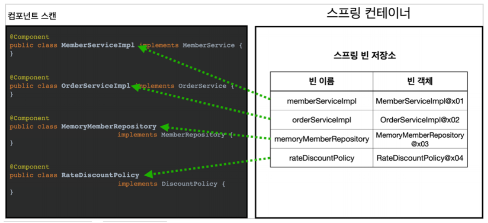

## 목차
{: .no_toc .text-beta }

1. TOC
{:toc .text-gamma}
---

## **컴포넌트 스캔과 의존관계 자동 주입**
> + 컴포넌트 스캔을 사용하면 `@ComponentScan` 어노테이션이 붙은 설정 정보까지 자동으로 등록된다.
> + 그래서 `excludeFilters` 을 사용하여 설정 정보를 스캔 대상에서 제외한다.
> + 컴포넌트 스캔은 @Component 어노테이션이 붙은 클래스를 스캔해서 스프링 빈으로 등록한다.
> + @Configuration 소스를 열어보면 @Components 어노테이션이 붙어있다. 따라서 이 또한 스캔의 대상이다.
> + 사용할 클래스들에 @Component 어노테이션을 추가하고, 의존관계 또한 자동으로 주입하기 위해 @Autowired를 추가한다.

```java
package hello.core;

import hello.core.member.MemberRepository;
import hello.core.member.MemoryMemberRepository;
import org.springframework.context.annotation.Bean;
import org.springframework.context.annotation.ComponentScan;
import org.springframework.context.annotation.Configuration;
import org.springframework.context.annotation.FilterType;

@Configuration
// @ComponentScan : 어노테이션이 붙은 클래스를 찾아서 자동으로 스프링 빈으로 등록해준다.
@ComponentScan(
        // basePackages : 탐색 시작 위치 설정
        basePackages = "hello.core.member",
        // basePackageClasses : 지정한 클래스의 패키지를 탐색 위치로 지정한다.
        basePackageClasses = AutoAppConfig.class,
        excludeFilters = @ComponentScan.Filter(type = FilterType.ANNOTATION, classes = Configuration.class)
)
public class AutoAppConfig {
    @Bean(name = "memoryMemberRepository2")
    MemberRepository memberRepository() {
        return new MemoryMemberRepository();
    }
}

```

---

## **@Component**
> 
> + @ComponentScan 은 @Component 가 붙은 모든 클래스를 스프링 빈으로 등록한다.
> + 이 때 스프링 빈의 기본 이름은 클래스명을 사용하되, 맨 앞글자만 소문자를 사용한다.
> + ex) MemberServiceImpl 클래스 > memberServiceImpl
> + 만약 스프링 빈의 이름을 직접 지정하고 싶으면 `@Component("memberService2")` 형태로 이름을 부여하면 된다.

---

## **@Autowired 의존관계 자동 주입**
> 
> + 생성자에 `@Autowired` 를 지정하면 스프링 컨테이너가 자동으로 해당 스프링 빈을 찾아서 주입한다.
> + 이 때 기본적으로는 타입이 같은 빈을 찾아서 조회한다.
> + `getBean(MemberRepository.class)` 와 동일하다고 이해하면 된다.

---

## **탐색할 패키지의 시작 위치 지정**
> + 필요한 위치부터 탐색하도록 시작 위치를 지정해서 시간을 단축시킬 수 있다.
> + basePackages : 탐색할 패키지의 시작 위치를 지정한다. 해당 패키지를 포함한 모든 하위 패키지를 탐색한다.
>   + ex) basePackages = "hello.core.member" 와 같은 방식으로 시작 위치를 지정할 수 있다.
> + basePackageClasses : 지정한 클래스의 패키지를 탐색 위치로 지정한다.
>   + ex) basePackageClasses = AutoAppConfig.class
> + ❗ 만약 지정하지 않으면 @ComponentScan 이 붙은 설정 정보 클래스의 패키지가 시작 위치가 된다.

---

### **탐색할 패키지의 시작 위치 지정 권장 방법**
> + 패키지 위치를 지정하지 않고 설정 정보 클래스의 위치를 프로젝트 최상단에 두는 것이다.
> + 예를 들어 아래와 같은 프로젝트 구조가 있다고 해보자.
>   1. com.hello
>   2. com.hello.service
>   3. com.hello.repository
> + com.hello 에 AppConfig 같은 메인 설정 정보를 두고 @ComponentScan 어노테이션을 붙이고 basePackages 지정은 생략한다.
> + 이렇게 하면 com.hello 를 포함한 하위는 모두 컴포넌트 스캔의 대상이 된다.
> + ❗ 참고로 스프링 부트를 사용하면 스프링 부트의 대표 시작 정보인 @SpringBootApplication 을 이 프로젝트 시작 루트 위치에 두는 것이 관례이다.

---

## **컴포넌트 스캔 기본 대상**
> **어노테이션에는 상속관계라는 것이 없다.<br>
> 그런데 어노테이션이 특정 어노테이션을 들고 있는 것을 인식할 수 있는 것은 자바 언어가 지원하는 것이 아니라 스프링이 지원하는 기능이다.**
> + **<font color='#0101DF'>@Component</font>** : 컴포넌트 스캔에서 사용한다.
> + **<font color='#0101DF'>@Controller</font>** : 스프링 MVC 컨트롤러에서 사용한다.
> + **<font color='#0101DF'>@Service</font>** : 스프링 비즈니스 로직에서 사용한다.
> + **<font color='#0101DF'>@Repository</font>** : 스프링 데이터 접근 계층에서 사용한다.
> + **<font color='#0101DF'>@Configuration</font>** : 스프링 설정 정보에서 사용한다.<br>
> <br>
>> **다음 어노테이션들은 스프링의 부가적인 기능이다. (위에 적힌 컴포넌트 역할을 포함하여 수행한다.)**
>> + **<font color='#0101DF'>@Controller</font>** : 스프링 MVC 컨트롤러로 인식한다.
>> + **<font color='#0101DF'>@Service</font>** : 특별한 처리를 하지 않는다. 대신 개발자들이 핵심 비즈니스 로직이 위치한 곳이라고 비즈니스 계층을 인식하는데 도움이 된다.
>> + **<font color='#0101DF'>@Repository</font>** : 스프링 데이터 접근 계층으로 인식하고, 데이터 계층의 예외를 스프링 예외로 변환해준다.
>>   + ex) DB 등이 바뀌면 그에 대한 예외도 전부 바뀌게 되는데, 이 탓에 다른 계층들까지 흔들리게 된다. 이를 방지해준다.
>> + **<font color='#0101DF'>@Configuration</font>** : 스프링 설정 정보로 인식하고 스프링 빈이 싱글톤을 유지하도록 추가적인 처리를 해준다.
>> + `useDafaultFilters 옵션` : 기본적으로 켜져있으며 이 옵션을 끄면 기본 스캔 대상들이 제외된다.

---

## **필터**
> + **<font color='#0101DF'>includeFilters</font>** : 컴포넌트 스캔 대상을 추가로 지정한다.
> + **<font color='#0101DF'>excludeFilters</font>** : 컴포넌트 스캔에서 제외할 대상을 지정한다.
> + 사실 `@Component 면 충분`하기 때문에 includeFilters를 사용할 일은 거의 없다.
> + `excludeFilters`는 간혹 사용하지만 이 또한 많이 쓰지는 않는다.

### **FilterType 옵션**
> + **ANNOTATION** : 기본값이며 어노테이션을 인식해서 동작한다.
>   + ex) org.example.SomeAnnotation
> + **ASSIGNABLE_TYPE** : 지정한 타입과 자식 타입을 인식해서 동작한다.
>   + ex) org.example.SomeClass
> + **ASPECTJ** : AspectJ 패턴을 사용한다.
>   + ex) org.example..*Service+
> + **REGEX** : 정규 표현식이다.
>   + ex) org\.example\.Default.*
> + **CUSTOM** : TypeFilter 이라는 인터페이스를 구현해서 처리한다.
>   + ex) org.example.MyTypeFilter

---

## **중복 등록과 충돌**
> + 컴포넌트 스캔에서 같은 빈 이름을 등록하면 다음 두 가지의 상황이 발생한다.
>   1. 자동 빈 등록 VS 자동 빈 등록
>   2. 수동 빈 등록 VS 자동 빈 등록


### **자동 빈 등록 VS 자동 빈 등록**
> + 컴포넌트 스캔에 의해 자동으로 스프링 빈이 등록되는데, 그 이름이 같은 경우 스프링은 오류를 발생시킨다.
> + `ConflictingBeanDefinitionException` 예외가 발생한다.

### **수동 빈 등록 VS 자동 빈 등록**
> + 수동으로 등록한 빈이 우선권을 가진다.
> + 수동으로 등록한 빈이 자동으로 등록한 빈을 오버라이딩한다.
> + 그러나 의도하지 않아서 잡기 어려운 버그가 만들어지기 때문에 최근에 스프링 부트에서는 오류가 발생하도록 기본값을 바꾸었다.
> + 스프링 부트인 CoreApplication 을 실행하면 해당 오류를 볼 수 있다.