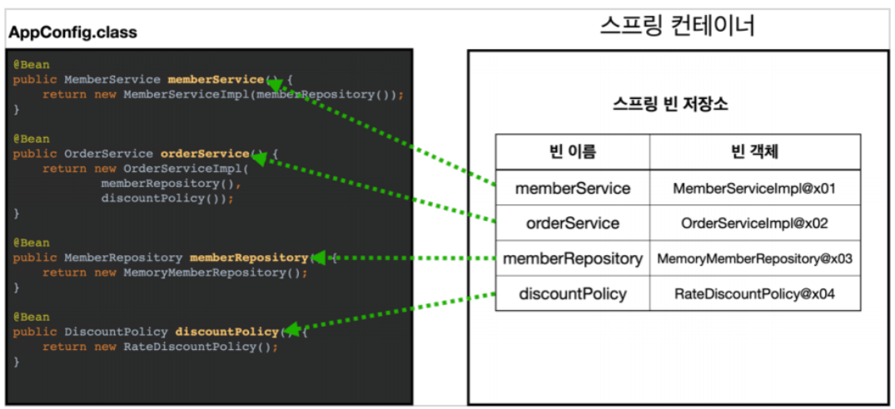

## 목차
{: .no_toc .text-beta }

1. TOC
{:toc .text-gamma}
---

# **스프링 컨테이너**
## **스프링 컨테이너 생성**
> + ApplicationContext 를 스프링 컨테이너라고 하며 이는 인터페이스이다.
> + 인터페이스이기 때문에 다형성이 적용되어 있다.
> + 스프링 컨테이너는 XML을 기반으로 만들 수 있고, 어노테이션 기반의 자바 설정 클래스로도 만들 수 있다.
> + 최근에는 XML 기반으로는 잘 쓰이지 않는다. 
> + 스프링 컨테이너를 생성하는 코드는 다음과 같다. 

```java
ApplicationContext applicationContext = new AnnotationConfigApplicationContext(AppConfig.class);
```

---
## **스프링 컨테이너 생성 과정**
> **[ 1. 스프링 컨테이너 생성 ]**
> 
> 
> + 스프링 컨테이너를 생성하여 만들면, 그 안에 스프링 빈 저장소가 생긴다.
> + 스프링 빈 저장소에는 빈 이름과 빈 객체가 들어가는데, 빈 이름은 Key이고 빈 객체는 Value 이다.
> + 스프링 컨테이너를 생성할 때에는 구성 정보를 지정해주어야 한다.
> + 이 때 구성 정보란 AppConfig 를 의미하며 AppConfig를 파라미터로 전달한다는 의미와 구성 정보를 지정한다는 의미는 동일하다고 볼 수 있다.

---

> **[ 2. 스프링 빈 등록 ]**
> 
> + AppConfig 설정정보에서 @Bean이 붙은 메소드들을 모두 호출한다.
> + 호출한 메소드에서 메소드명을 빈 이름으로 지정하고 반환받은 객체를 빈 객체에 등록한다.
> + 빈 이름은 메서드 이름을 사용한다.
> + 빈 이름은 항상 다른 이름을 부여해야 한다. 동일한 이름을 부여하면 다른 빈이 무시되거나, 기존 빈을 덮어버리거나, 설정에 따라 오류가 발생하기도 한다.
> + 빈 이름을 직접 부여할 수도 있으며 코드는 다음과 같다.

```java
@Bean(name="memberService2")
```

---

> **[ 3.  스프링 빈 의존관계 설정]**
> 
> + 스프링 빈 등록을 한 다음에 의존관계를 넣어준다.
> + 스프링 컨테이너는 설정 정보를 참고해서 의존관계를 주입(DI)한다.

---

## **📌 핵심**
> + 스프링은 빈을 생성하고, 의존관계를 주입하는 단계가 나누어져 있다.
> + 그런데 위처럼 자바 코드로 스프링 빈을 등록하면 생성자를 호출함과 동시에 의존관계 주입도 한번에 처리된다.
>   1. memberService()를 생성하고, 이를 호출한다.
>   2. 여기에 @Bean이 붙어있으므로 new MemberServiceImpl 객체를 생성하며 memberRepository 코드를 호출한다.
>   3. 그로 인해 memberRepository 가 생성된다.
>   4. 즉, memberService()를 호출함과 동시에 의존관계가 주입되는 것이다.